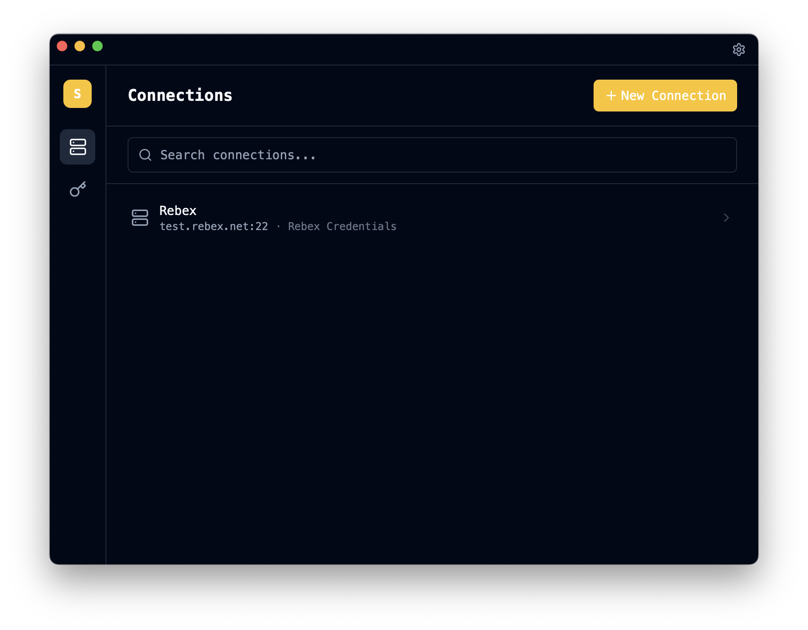

# SSX — SSH Client

[](https://github.com/gregorybarille/ssix/actions/workflows/test.yml)

SSX is a desktop SSH client built with Tauri, React, and Rust. It combines saved SSH connections, reusable credentials, tabbed and split terminals, tunnels, SCP transfers, diagnostics, screenshots, and Git-backed config sync in one app.



## Highlights

- Direct SSH, port forward, and jump-shell connections
- Saved credentials with password, key-path, and inline-key support
- Terminal tabs and split panes
- SCP upload/download, including recursive directory transfer
- Logs, screenshots, search, tags, and connection colors
- Sanitized Git sync with diff, fetch, pull, commit, push, and one-click sync

## Install

Prerequisites:

- Rust stable
- Node.js 20+
- npm 9+

```bash
git clone https://github.com/gregorybarille/ssx
cd ssx
npm install
npm run tauri build
```

## Development

```bash
npm install
npm run tauri dev
npm test
cd src-tauri && cargo test
```

## Quick Start

1. Create a credential or use inline auth in the connection form.
2. Create a direct, port-forward, or jump-shell connection.
3. Connect from the Connections view.
4. Optionally set `login_command` and `remote_path` on the connection.
5. Use `Transfer files` for SCP or `Git Sync` for sanitized config sync.

## Documentation

- [Features](docs/features.md)
- [Architecture](docs/architecture.md)
- [Development](docs/development.md)
- [Git Sync](docs/git-sync.md)
- [File Transfer](docs/file-transfer.md)
- [Troubleshooting](docs/troubleshooting.md)

## Storage

- Runtime config: `~/.ssx/data.json`
- Secrets: `~/.ssx/secrets.json`
- Optional Git export: `.ssx-sync/` inside your configured sync repository

## License

MIT
