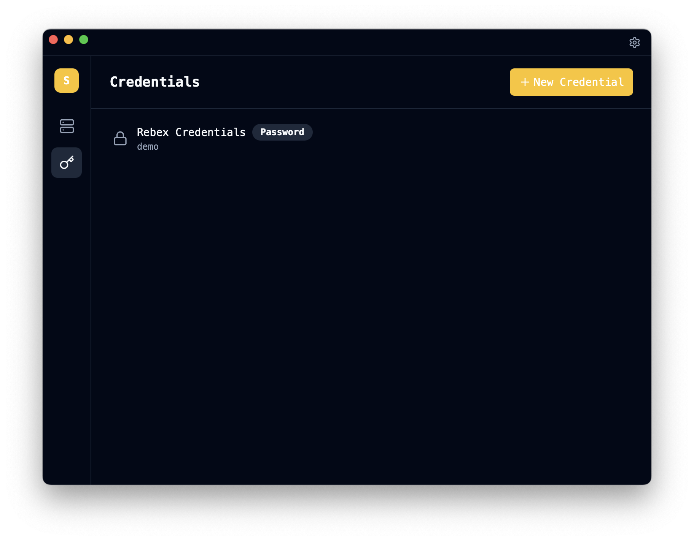
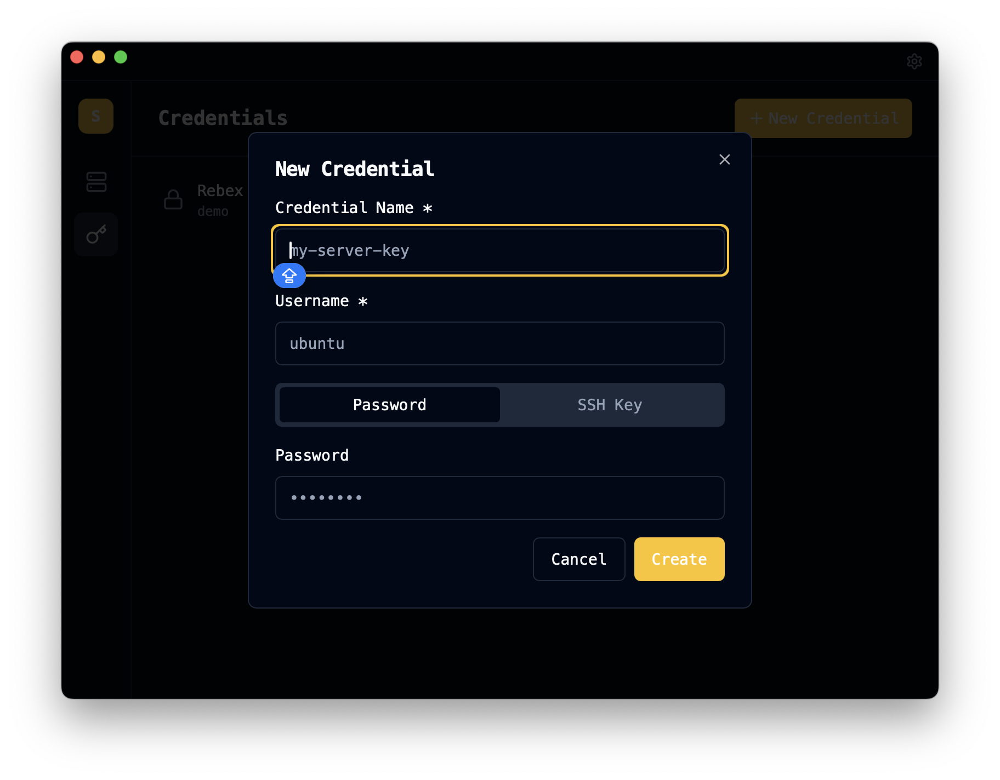
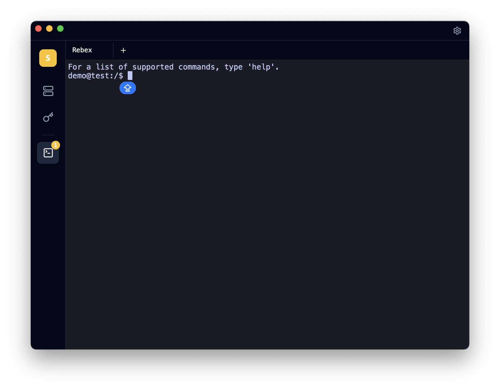

# SSX — SSH Client

[](https://github.com/gregorybarille/ssix/actions/workflows/test.yml)

A modern desktop SSH client built with [Tauri v2](https://v2.tauri.app/), React, and Rust.


## Features

- **SSH Terminal** — Connect to remote servers with an interactive terminal powered by xterm.js
- **Multi-tab Sessions** — Run multiple SSH sessions side-by-side with a tabbed interface
- **Connections** — Create, edit, clone, and search saved connections
- **Credentials** — Store passwords or SSH key paths securely
- **Tunnel / Jump Host** — SSH through a gateway to reach internal servers
- **Settings** — Customize font, font size, color scheme (Open Colors), and dark/light theme
- **Cross-platform** — macOS, Windows, and Linux with native titlebar integration

## Screenshots

| Credentials | New Credential | Terminal |
|:-----------:|:--------------:|:--------:|
|  |  |  |

## Installation

Download the latest release for your platform from the [Releases](../../releases) page.

### Build from Source

**Prerequisites:**
- [Rust](https://rustup.rs/) (1.70+)
- [Node.js](https://nodejs.org/) (20+)
- npm (9+)
- Platform system dependencies (see [docs/development.md](docs/development.md))

```bash
git clone https://github.com/gregorybarille/ssx
cd ssx
npm install
npm run tauri build
```

## Development

```bash
npm install
npm run tauri dev   # Start dev server
npm test            # Frontend tests
cd src-tauri && cargo test  # Backend tests
```

## Usage

### Connections

1. Click the **Server** icon in the sidebar
2. Click **New Connection** to create a connection
3. Enter name, host, port, and choose an auth method (saved credential, password, or SSH key)
4. For tunneled connections, switch to the **Tunnel** tab and configure the gateway
5. Hover over a connection to see **Edit**, **Clone**, and **Delete** actions
6. Click the **▶** button to connect and open a terminal session

### Terminal Sessions

- Active sessions appear in a tab bar at the top of the terminal view
- Click **+** to open an additional connection from the tab bar
- Switch between sessions by clicking tabs
- Close a session by clicking **×** on its tab
- The sidebar shows a terminal icon with a badge count when sessions are active

### Credentials

1. Click the **Key** icon in the sidebar
2. Click **New Credential**
3. Enter a name and username
4. Choose **Password** or **SSH Key** type
5. For SSH keys, enter the path to your private key file

### Search

Type in the search bar at the top of the connections view to filter by name or host.

### Clone Connection

Hover over a connection and click the **Copy** icon to clone it. You can modify the name, host, port, and credential.

### Settings

1. Click the **Settings** (gear) icon in the sidebar
2. Choose your preferred font family and size
3. Select a color scheme from Open Colors palette
4. Toggle between dark and light theme
5. Click **Save Settings**

## Configuration

All data is stored in `~/.ssx/data.json`:

```json
{
  "credentials": [
    {
      "id": "uuid",
      "name": "my-key",
      "username": "ubuntu",
      "type": "ssh_key",
      "private_key_path": "/home/user/.ssh/id_rsa"
    }
  ],
  "connections": [
    {
      "id": "uuid",
      "name": "prod-server",
      "host": "192.168.1.100",
      "port": 22,
      "credential_id": "uuid",
      "type": "direct"
    }
  ],
  "settings": {
    "font_size": 14,
    "font_family": "JetBrains Mono",
    "color_scheme": "blue",
    "theme": "dark"
  }
}
```

## License

MIT
